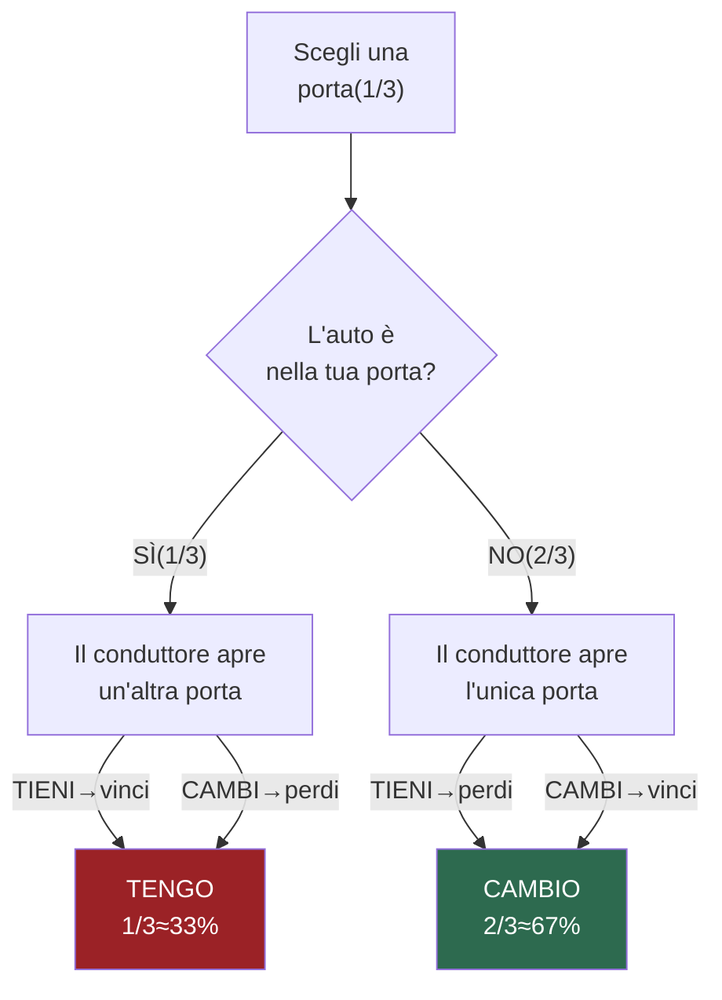

# Il Dilemma di Monty Hall

## Requisiti

- Python 3.6+

## Esecuzione

```bash
# Partita interattiva
python3 montyHall-interattivo.py

# Simulazione statistica (default: 10.000 partite)
python3 montyHall-stats.py

# Simulazione con numero di partite personalizzato
python3 montyHall-stats.py 50000
```

---

## Cos'è il Dilemma di Monty Hall?

Il **Problema di Monty Hall** è un celebre rompicapo probabilistico ispirato all'omonimo conduttore del gioco televisivo americano *Let's Make a Deal*.

**La situazione:**
1. Davanti a te ci sono **3 porte**. Dietro a una c'è un'**auto**, dietro alle altre due ci sono delle **capre**.
2. Scegli una porta.
3. Il conduttore (che sa dove si trova l'auto) **apre una delle porte rimanenti**, rivelando sempre una capra.
4. Ti viene offerta la possibilità di **cambiare** la tua scelta con l'altra porta ancora chiusa, oppure di **tenerla**.

**Domanda:** conviene cambiare porta o tenere quella originale?

La risposta **controintuitiva** è che conviene sempre cambiare: la probabilità di vincere raddoppia passando da **1/3 a 2/3**.

---

## Perché conviene cambiare? La spiegazione visiva



**La chiave:** quando scegli la prima porta hai 1/3 di probabilità che l'auto sia lì. Questo significa che c'è una probabilità di 2/3 che l'auto si trovi tra le altre due porte. Quando il conduttore elimina una di quelle porte mostrando una capra, tutta la probabilità di 2/3 si concentra sull'unica porta rimasta. Cambiare porta equivale quindi a "scommettere" che la tua prima scelta fosse sbagliata — e statisticamente lo è nel 2/3 dei casi.

---

## I codici Python

### `montyHall-interattivo.py` — Gioca tu stesso

Permette di giocare una singola partita interattiva direttamente dal terminale.

**Come funziona:**
1. Il programma posiziona l'auto dietro una porta scelta casualmente.
2. Ti chiede di scegliere una porta (1, 2 o 3).
3. Rivela una porta con una capra tra quelle che non hai scelto e che non nascondono l'auto.
4. Ti chiede se vuoi `tenere` la tua scelta o `cambiare`.
5. Rivela il risultato.

**Esempio di esecuzione:**
```
Inserisci un numero da 1 a 3: 1
Hai scelto la porta: 1
Il conduttore apre la porta 3 e contiene una capra

Sono rimaste due porte, vuoi tenere quella che hai scelto o vuoi cambiare?(tengo/cambio): cambio
Hai vinto!
```

---

### `montyHall-stats.py` — Simulazione statistica

Simula **10.000 partite** (o un numero personalizzato passato come argomento) assegnando casualmente ad ogni partita la strategia "tengo" o "cambio", e calcola le percentuali di vittoria per ciascuna.

**Come funziona:**
1. Per ogni partita genera casualmente la porta vincente e la scelta iniziale del giocatore.
2. Simula l'apertura della porta con la capra da parte del conduttore.
3. Assegna casualmente la strategia (`tengo` o `cambio`).
4. Registra vittoria o sconfitta per ciascuna strategia.
5. Stampa le statistiche finali.

**Esempio di output:**
```
Partite totali: 10000
Tengo:  1673/4985 vittorie (33.56%)
Cambio: 3361/5015 vittorie (67.02%)
```

I risultati confermano empiricamente la teoria: cambiare porta vince circa il **67%** delle volte, tenere solo il **33%**.

